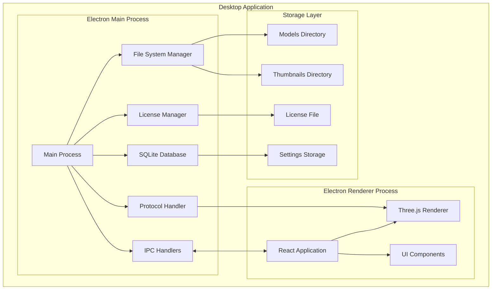
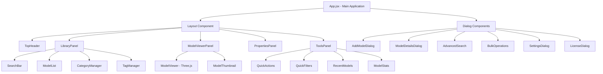
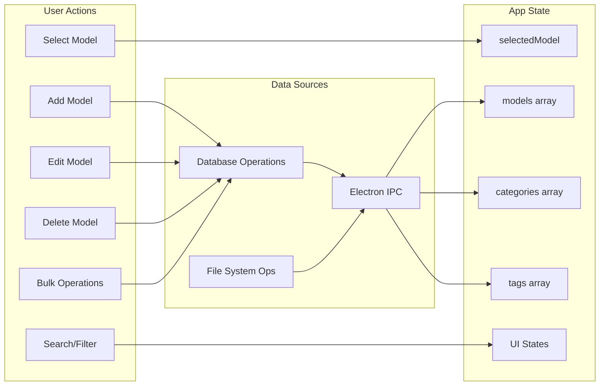
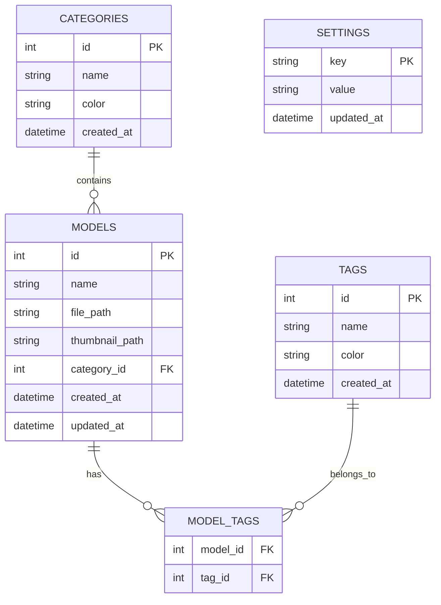
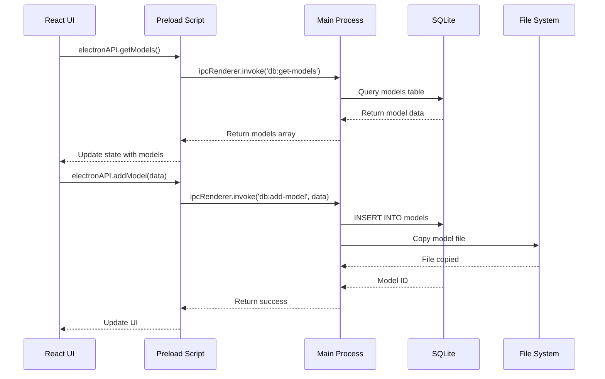
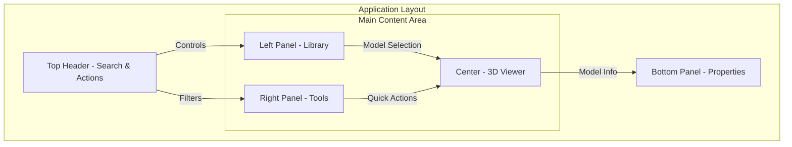
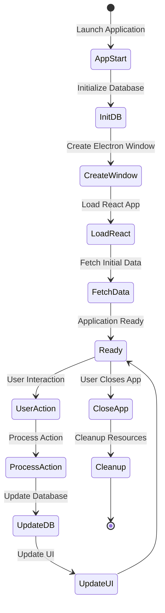
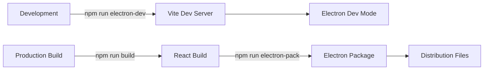

# P3DV (Presentation 3D Viewer) - Architecture Analysis & Visualization

## 📋 Executive Summary

P3DV is a sophisticated desktop application built with Electron and React that provides a comprehensive 3D model viewing and management system. The application features offline-first capabilities, local file management, and a planned licensing system.

## 🏗️ Technology Stack

### Core Technologies
- **Desktop Framework**: Electron (v28.1.0)
- **Frontend Framework**: React (v18.2.0) with Vite
- **3D Rendering**: Three.js (v0.158.0) with React Three Fiber
- **Database**: SQLite3 (embedded)
- **Styling**: Tailwind CSS (CDN)
- **State Management**: React Hooks (useState, useEffect)

## 🎯 Application Architecture

### High-Level Architecture



## 🧩 Component Architecture

### Component Hierarchy



## 📊 Data Flow Architecture

### State Management Flow



## 💾 Database Schema



## 🔄 IPC Communication Pattern



## 🎨 UI Layout Structure



## 🚀 Key Features

### Core Functionality
1. **3D Model Viewing**
   - GLB file format support
   - Interactive 3D controls (zoom, rotate, pan)
   - Custom protocol handler (p3dv-models://)

2. **Library Management**
   - Add/Edit/Delete models
   - Category organization
   - Tag system
   - Bulk operations

3. **Search & Filter**
   - Basic text search
   - Advanced search with multiple criteria
   - Quick filters by category/tag
   - Date range filtering

4. **Data Management**
   - Local SQLite database
   - File system integration
   - Export/Import capabilities
   - Thumbnail generation

5. **User Interface**
   - Collapsible panels
   - Responsive layout
   - Dark mode support (planned)
   - Keyboard shortcuts (planned)

## 🔐 Security & Licensing

### Planned Features (Phase 2)
- One-time activation system
- Hardware fingerprinting
- License key validation
- Offline license verification

## 📁 File System Structure

```
userData/
├── p3dv.db              # SQLite database
├── models/              # 3D model files
│   ├── model_1.glb
│   ├── model_2.glb
│   └── ...
├── thumbnails/          # Model thumbnails
│   ├── thumb_1.png
│   ├── thumb_2.png
│   └── ...
├── exports/             # Export directory
│   └── p3dv-export-*/
└── license.json         # License data
```

## 🔄 Application Lifecycle



## 📈 Performance Considerations

1. **Lazy Loading**: Models are loaded on-demand
2. **Thumbnail Caching**: Thumbnails stored locally
3. **Database Indexing**: Optimized queries for large libraries
4. **Virtual Scrolling**: Planned for large model lists
5. **WebGL Optimization**: Three.js performance tuning

## 🛠️ Development Workflow



## 📝 Component Responsibilities

### Main Components

| Component | Responsibility | Key Features |
|-----------|---------------|--------------|
| **App.jsx** | Main application orchestrator | State management, data loading, event handling |
| **Layout.jsx** | UI layout manager | Panel collapse/expand, responsive layout |
| **LibraryPanel.jsx** | Model library interface | Model list, categories, tags, search |
| **ModelViewer.jsx** | 3D rendering | Three.js integration, model loading |
| **ModelViewerPanel.jsx** | Viewer container | Controls, empty state, viewer wrapper |
| **PropertiesPanel.jsx** | Model metadata display | Details, stats, actions |
| **ToolsPanel.jsx** | Quick tools & actions | Filters, stats, recent models |

### Dialog Components

| Component | Purpose | Features |
|-----------|---------|----------|
| **AddModelDialog** | Add new models | File selection, metadata input |
| **ModelDetailsDialog** | Edit model details | Full CRUD operations |
| **AdvancedSearch** | Complex search | Multi-criteria filtering |
| **BulkOperations** | Batch actions | Move, delete, tag multiple |
| **SettingsDialog** | App configuration | Preferences, themes |
| **LicenseDialog** | License activation | Key validation, activation |

## 🎯 Future Enhancements

### Phase 2 - Licensing
- ✅ License validation UI
- ⏳ Remote API integration
- ⏳ Activation state persistence

### Phase 3 - Deep Linking
- ⏳ Custom protocol registration
- ⏳ URL parsing and routing
- ⏳ External model loading

### Phase 4 - Production
- ⏳ Auto-updates
- ⏳ Analytics integration
- ⏳ Performance monitoring
- ⏳ Error reporting

## 🔍 Key Observations

### Strengths
1. **Modular Architecture**: Well-separated concerns
2. **Offline-First**: Works without internet
3. **Comprehensive UI**: Rich feature set
4. **Scalable Design**: Ready for growth

### Areas for Improvement
1. **State Management**: Consider Redux/Zustand for complex state
2. **Error Handling**: Implement comprehensive error boundaries
3. **Testing**: Add unit and integration tests
4. **Documentation**: Enhance inline documentation
5. **Performance**: Implement virtualization for large lists

## 📊 Metrics & Statistics

- **Total Components**: 24 React components
- **Database Tables**: 5 tables
- **IPC Channels**: 20+ handlers
- **File Types Supported**: GLB (3D models)
- **UI Panels**: 5 collapsible panels
- **Dialog Types**: 6 modal dialogs

---

*Generated on: 2025-09-21*
*Analysis based on codebase structure and implementation*